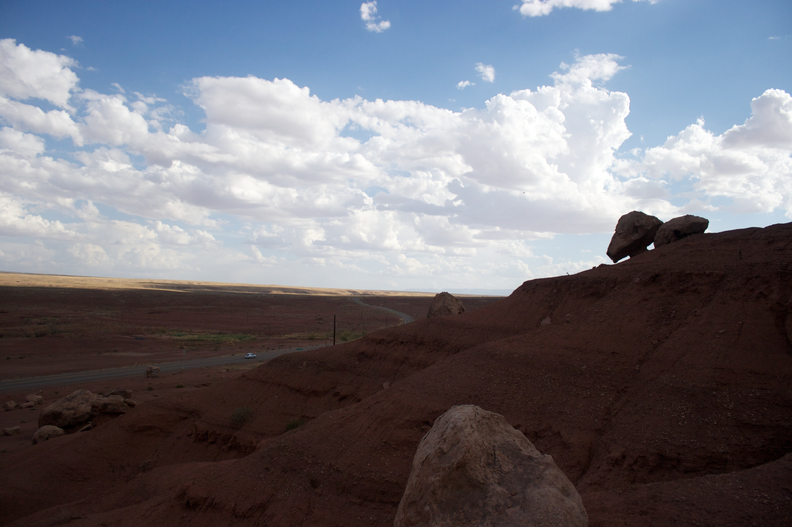
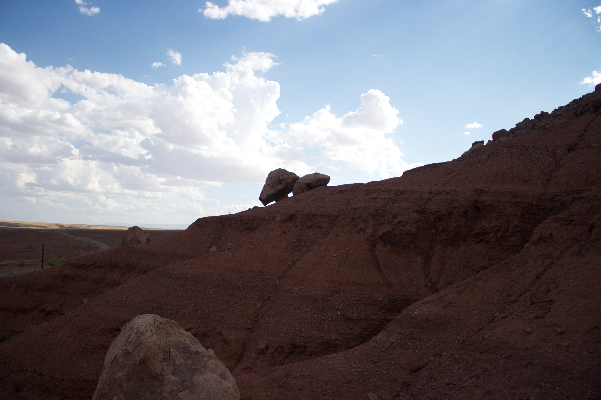
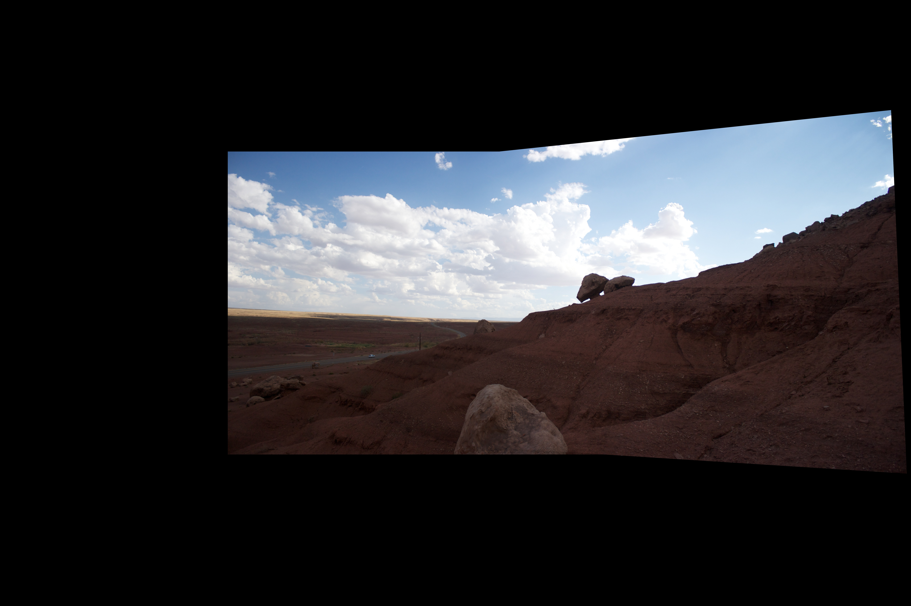

# Image-Panoramas
Experimentation with Image Stitching Methods

Given a set of photos, the program will be able to stitch them into a panoramic photo.

Image 1 --->       
Image 2 ---> 
Stitched image ---> 

Strategies Utilized :
1. Scale-invariant feature transform (SIFT) :  Feature detection algorithm to detect and describe local features in images
2. Feature Description : extract feature vector descriptor surrounding each interest point
3. Feature Matching : Determine correspondence between descriptors in two views
              Sum of Square differences(SSD) between enteries of two descriptors 
              Find SSD ratio between two features to find the best matched points (Best matched points have lower value of ratio)
4. Computing Homography
5. Image Warping
6. Image Stitching

